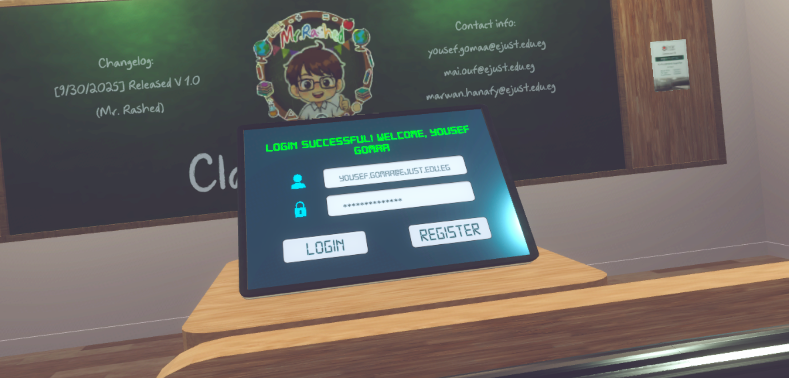
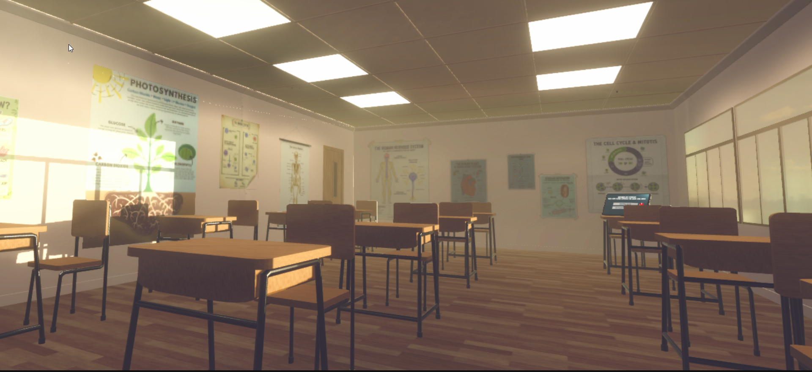
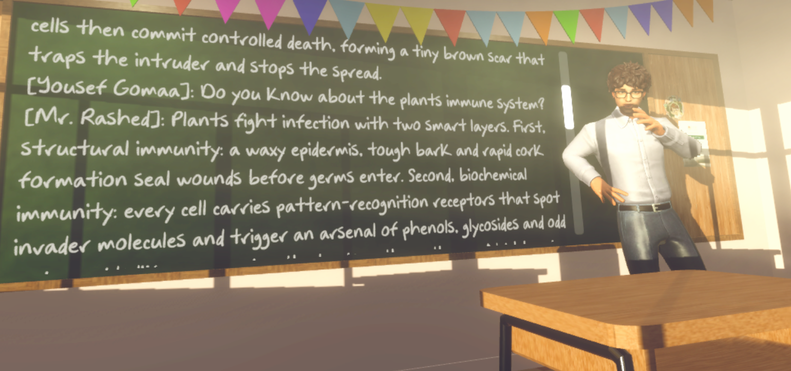
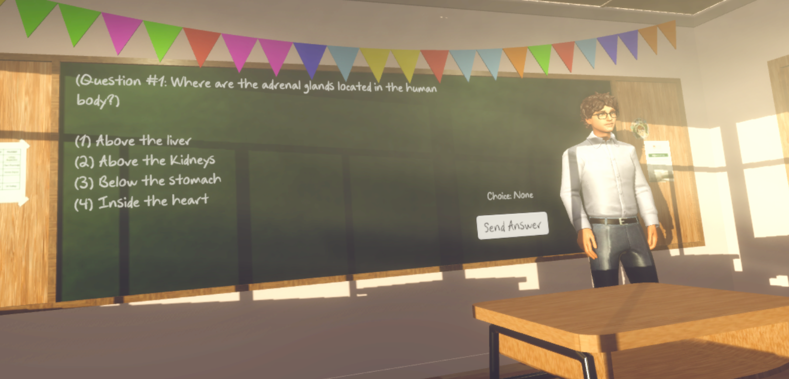
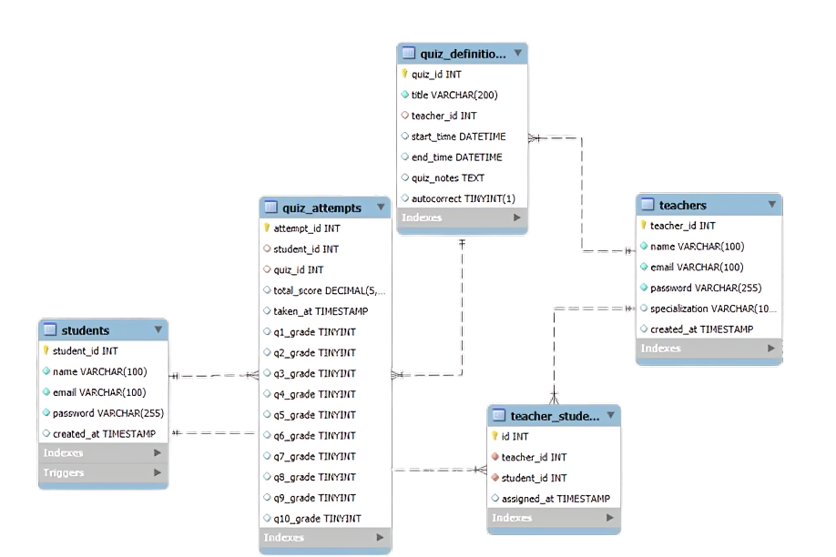
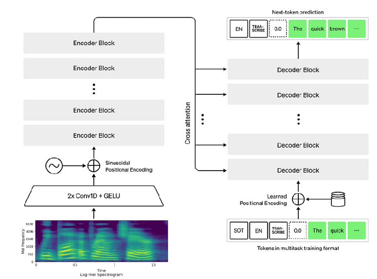
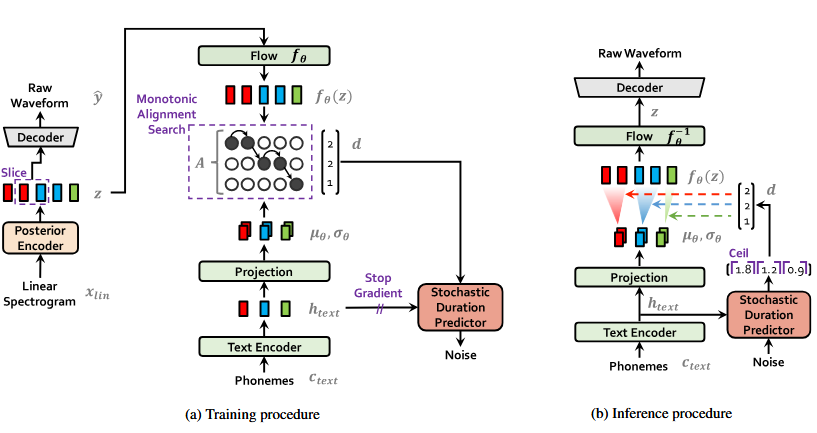

<div align="center">

[](https://www.facebook.com/ejust.official/posts/-ai-accelerated-appathon-from-concept-to-code-with-generative-aihosted-by-the-co/749010944187251/)

<a>
  <p align="center">
    <picture>
      <source media="(prefers-color-scheme: dark)" srcset="Images\Webpage\banner-3.png">
      
    </picture>
  </p>
</a>

</div>

---

# Classroom VR: A project by Team 10Q 

An advanced VR education classroom featuring specialized AI tutors for different subjects. Experience personalized learning through immersive virtual reality with curriculum-aligned AI teachers who adapt to your learning style.

## Demo Video:

## Features: (as of now)

- Specialized AI teacher in an Interactive VR environment: Mr. Rashid (Biology)!
- RAG-powered curriculum accuracy for official secondary education standards!
- Multi-intent detection: Q&A, explanations, summaries, exam prep, and more!
- Optimized responses perfectly crafted for display and text-to-speech!
- Contextual memory that remembers your learning journey across sessions!
- Quiz Mode where you can follow up your quizzes and test your knowledge and have the result immediately!

### Available VR Classrooms:

#### - Mr. Rashed - Biology Expert (Our Mascot)

- Egyptian secondary senior biology curriculum mastery.
- Specializes in cellular biology, genetics, human systems, and ecology.
- Patient mentor who makes complex biological concepts accessible.
- Available in **Free Questions** mode and **Quiz** mode!

#### NOTE:

- In the long term, we plan to include Ms. Inas, a Chemistry Specialist and Mr. Sheriff, a Physics Master as part of our program
- You could also register as a teacher with us! Contact: [yousef.gomaa@ejust.edu.eg](mailto:yousef.gomaa@ejust.edu.eg)

## Hardware Requirements:

- Meta Quest 2/3/3S with ≥1 GB free storage.
- A good USB-C cable (USB 3.0 preferred) or Air Link (optional). (for development build)

## Setup Method:

### APK File

- Install the Meta Quest app on your phone and log in with your Meta account.
- Pair your headset in the app.
- In the phone app: Menu → Devices → your Quest → Developer Mode → On.
- Reboot the headset, then enable "Allow USB Debugging" when connecting the cable with your preferred device of choice.
- Install SideQuest (desktop).
- Plug in the Quest, ensure the top-left dot in SideQuest is green (authorized).
- Download the latest APK release from the [Releases](https://github.com/37743/Classroom-VR/releases) sidepanel. 
- On SideQuest, select Install APK from folder (down-arrow icon) → pick your .apk → wait for "Success".
- Now you can run the application locally through: Apps → filter Unknown Sources → launch your app.

### Development Build (optional)

- Clone the repository (with Git LFS).
- Import the project with the exact Unity version from ProjectSettings/ProjectVersion.txt (via Unity Hub).
  - Unity packages/dependencies are included in Packages/packages.json
  - RAG servers would require you to install the packages in each respective directory's ~/requirements.txt
- Configure your build with the following: Android / Oculus XR / ARM64 / IL2CPP.
- Launch the build using Playmode.

***DISCLAIMER:***

- You would need to host and connect (through the inspector) your own RAG/LLM/SQL servers on your machine using the models (optional) uploaded in ~/RAG Models/ and database backup uploaded in ~/SQL/ as well as any API keys.
  - **EXAMPLE:**
    - 1. Set up your curriculum data files: `Bio_curriculum_chunks1000_over20.csv`, `Bio_curriculum_faiss_index_1000_over20.bin`
      2. Configure server settings:
         ```python
         API_KEY = "your_groq_api_key"
         HOST = "your_server_ip"
         PORT = 8000
         ```
      3. Start the server:
         ```bash
         python mr_rashid_server.py
         ```
         
## Usage

1. Login with your account.

<div align="center">

|  |
| :----------------------------------: |
|              Login Menu              |

</div>

2. Connect to your chosen VR learning classroom.

<div align="center">

|  |
| :--------------------------------------------: |
|       Immersive VR Learning Environment        |

</div>

3. Interact & get personalized explanations from your AI teacher (Mr. Rashed shown).

<div align="center">

|  |
| :-----------------------------------------------------------------: |
|                    Personalized Learning Experience                 |

</div>

4. Explore Quiz mode and challenge yourself.

<div align="center">

|  |
| :-----------------------------------------: |
|                  Quiz Mode                  |

</div>

## Frequently Asked Questions (FAQ)

- What makes Classroom VR teachers different from other AI tutors?
  - **ANSWER:** *Classroom VR teachers, for example Mr. Rashed, are specifically designed for their respective curriculum (e.g. Egyptian senior highschool year biology) with RAG-powered accuracy. Unlike generic AI models, it provides customized responses, remembers your learning context, and automatically detects what type of help you need (explanations, summaries, exam prep, etc.).*

## Application Stack
- Built in Unity 6 with Universal Render Pipeline (URP)
- Android Platform (ARMx64)
- Unity Sentis (also known as Unity Inference Engine) for execution of AI models
- Meta XR SDK (previously known as Oculus Integration) for VR framework
- SQL Database as a medium for storing users/teachers information, the schema shown below:

<div align="center">

|  |
| :----------------------------------------: |
|       vr_teacher Database ER Diagram     |

</div>
  
## Generative AI Usage Log
### Speech-to-Text & Text-to-Speech
- Open AI's open-source [Whisper Tiny](https://huggingface.co/openai/whisper-tiny) for automatic speech recognition. (supports English/German/French)
  - A state machine manages and runs the spectrogram model, encoder model, and decoder model.

<div align="center">

|  |
| :----------------------------------------: |
|       Whisper Tiny Architecture [(Source)](https://www.researchgate.net/figure/Whisper-Tiny-architecture_fig5_391777216)     |

</div>

- [Piper](https://github.com/OHF-Voice/piper1-gpl) (Piper phonemizer + eSpeak NG text-to-speech synthesizer) for free-software neural text-to-speech.It is made using VITS: Conditional Variational Autoencoder with Adversarial Learning for End-to-End Text-to-Speech.

<div align="center">

|  |
| :----------------------------------------: |
|       VITS Pipeline [(Source)](https://arxiv.org/abs/2106.06103)      |

</div>

- Generated audio is processed and in turn generates visemes which are used for OVR Lip Sync with teacher model's facial blendshapes.

<div align="center">
  
|  |
| :----------------------------------------: |
|       Animated Lipsync Example      |

</div>

### Prompts:
- There are 2 types of prompts generated and used in this project, both of which use TCP/IP communication with external servers hosting RAG models, and each accommodate for a specific mode:
  - **Free Questions Mode:** In this mode, you are free to speak to the chosen teacher, asking them to explain, summarize, generate mindmap/questions in relation to the assigned curriculum. The model blocks the user attempts when asking for anything out of context.
    - Prompt & Response Examples as taken from the Demonstration Video's logs: (JSON format)
      
<div style="display:flex; justify-content:center; margin:1em 0;">
  <table style="border-collapse:collapse; border:1px solid #ddd; font-family:system-ui, -apple-system, Segoe UI, Roboto, Arial, sans-serif; text-align:left; width:80%; max-width:900px;">
    <tbody>
      <!-- 1-a -->
      <tr>
        <td style="border:1px solid #ddd; padding:8px; text-align:center; font-weight:bold;">Prompt</td>
      </tr>
      <tr>
        <td style="border:1px solid #ddd; padding:8px;">
<pre style="margin:0; white-space:pre-wrap; word-break:break-word; overflow:hidden; font-family:monospace; text-align:left;"><code>{
  "id": "1-a",
  "role": "user",
  "content": "Hello Mr. Rashed, could you explain anything about physiological support?",
  "timestamp": "2025-10-02T11:24:16.452115"
}</code></pre>
        </td>
      </tr>
      <!-- 1-b -->
      <tr>
        <td style="border:1px solid #ddd; padding:8px; text-align:center; font-weight:bold;">Response</td>
      </tr>
      <tr>
        <td style="border:1px solid #ddd; padding:8px;">
<pre style="margin:0; white-space:pre-wrap; word-break:break-word; overflow:hidden; font-family:monospace; text-align:left;"><code>{
  "id": "1-b",
  "role": "assistant",
  "content": "Imagine your plant cells are tiny water balloons! When these balloons fill with water through osmosis, they get plump and press against each other - that's physiological support in action. It's like when you inflate a pool float - the water pressure inside keeps everything firm and upright.\n\nThis support is temporary because it depends entirely on water content. When your bean plants wilt on hot days, they've lost water and their cellular balloons have deflated. But give them water, and watch them perk up as osmosis refills their vacuoles!\n\nThe magic happens at the cellular level: water enters through the semi-permeable membrane, swelling the vacuole until the cell wall becomes taut. This creates internal pressure called turgor, which keeps herbaceous",
  "timestamp": "2025-10-02T11:24:18.314483"
}</code></pre>
        </td>
      </tr>
      <!-- 2-a -->
      <tr>
        <td style="border:1px solid #ddd; padding:8px; text-align:center; font-weight:bold;">Prompt</td>
      </tr>
      <tr>
        <td style="border:1px solid #ddd; padding:8px;">
<pre style="margin:0; white-space:pre-wrap; word-break:break-word; overflow:hidden; font-family:monospace; text-align:left;"><code>{
  "id": "2-a",
  "role": "user",
  "content": "Hello Mr. Rashed. What could you tell me about physiological support?",
  "timestamp": "2025-10-02T11:42:11.978048"
}</code></pre>
        </td>
      </tr>
      <!-- 2-b -->
      <tr>
        <td style="border:1px solid #ddd; padding:8px; text-align:center; font-weight:bold;">Response</td>
      </tr>
      <tr>
        <td style="border:1px solid #ddd; padding:8px;">
<pre style="margin:0; white-space:pre-wrap; word-break:break-word; overflow:hidden; font-family:monospace; text-align:left;"><code>{
  "id": "2-b",
  "role": "assistant",
  "content": "Think of physiological support as your plant's water-powered skeleton! When cells absorb water through osmosis, they swell like tiny balloons pressing against each other. This creates turgor pressure that keeps leaves and stems standing tall.\n\nWatch what happens when you soak dried peas - they plump up as water rushes into their vacuoles. But leave fresh beans on the counter? They shrivel as water escapes, losing their support.\n\nThis is nature's temporary scaffolding - no water means no pressure, and your plant wilts dramatically. Yet give it a drink, and within hours osmosis refills those cellular balloons, restoring its upright posture!",
  "timestamp": "2025-10-02T11:42:13.340368"
}</code></pre>
        </td>
      </tr>
      <!-- 3-a -->
      <tr>
        <td style="border:1px solid #ddd; padding:8px; text-align:center; font-weight:bold;">Prompt</td>
      </tr>
      <tr>
        <td style="border:1px solid #ddd; padding:8px;">
<pre style="margin:0; white-space:pre-wrap; word-break:break-word; overflow:hidden; font-family:monospace; text-align:left;"><code>{
  "id": "3-a",
  "role": "user",
  "content": "Is this somehow related to its Moses?",
  "timestamp": "2025-10-02T11:43:17.570982"
}</code></pre>
        </td>
      </tr>
      <!-- 3-b -->
      <tr>
        <td style="border:1px solid #ddd; padding:8px; text-align:center; font-weight:bold;">Response</td>
      </tr>
      <tr>
        <td style="border:1px solid #ddd; padding:8px;">
<pre style="margin:0; white-space:pre-wrap; word-break:break-word; overflow:hidden; font-family:monospace; text-align:left;"><code>{
  "id": "3-b",
  "role": "assistant",
  "content": "That question seems outside the biology curriculum I teach. Let's focus on topics like Support & Movement, Hormonal Coordination, Genetics, DNA and Protein Synthesis, Immunity, or Methods of Reproduction instead.",
  "timestamp": "2025-10-02T11:43:17.690993"
}</code></pre>
        </td>
      </tr>
      <!-- 4-a -->
      <tr>
        <td style="border:1px solid #ddd; padding:8px; text-align:center; font-weight:bold;">Prompt</td>
      </tr>
      <tr>
        <td style="border:1px solid #ddd; padding:8px;">
<pre style="margin:0; white-space:pre-wrap; word-break:break-word; overflow:hidden; font-family:monospace; text-align:left;"><code>{
  "id": "4-a",
  "role": "user",
  "content": "I meant Osmosis.",
  "timestamp": "2025-10-02T11:43:52.687835"
}</code></pre>
        </td>
      </tr>
      <!-- 4-b -->
      <tr>
        <td style="border:1px solid #ddd; padding:8px; text-align:center; font-weight:bold;">Response</td>
      </tr>
      <tr>
        <td style="border:1px solid #ddd; padding:8px;">
<pre style="margin:0; white-space:pre-wrap; word-break:break-word; overflow:hidden; font-family:monospace; text-align:left;"><code>{
  "id": "4-b",
  "role": "assistant",
  "content": "Ah, yes—osmosis is the engine behind physiological support! Water moves through the semi-permeable plasma membrane into the cell vacuole, swelling it like a tiny pump. The vacuole presses the cytoplasm against the stiff cell wall, creating turgor pressure that keeps herbaceous stems and leaves crisp and upright. When soil dries, water leaves the vacuole, turgor collapses, and the plant wilts—exactly what you see on a hot afternoon. Give the soil a drink, water re-enters by osmosis, turgor returns, and the plant stands tall again.",
  "timestamp": "2025-10-02T11:43:54.079202"
}</code></pre>
        </td>
      </tr>
    </tbody>
  </table>
</div>

  - **Quiz Mode:** While in this mode, which you are only able to join during specific times (queried through SQL database), the models generate 10 questions, which are answered via STT, the results are then stored in the SQL database.
    - Prompt & Response Examples as taken from the Demonstration Video's logs: (Sent and received as Strings, as only the quiz topic is needed for this prompt)

<div style="display:flex; justify-content:center; margin:1em 0;">
  <table style="border-collapse:collapse; border:1px solid #ddd; font-family:system-ui, -apple-system, Segoe UI, Roboto, Arial, sans-serif; width:80%; max-width:900px;">
    <tbody>
      <tr>
        <td style="border:1px solid #ddd; padding:8px; text-align:center; font-weight:bold;">Prompt</td>
      </tr>
      <tr>
        <td style="border:1px solid #ddd; padding:8px; text-align:center;">Hormonal Coordination</td>
      </tr>
      <tr>
        <td style="border:1px solid #ddd; padding:8px; text-align:center; font-weight:bold;">Response</td>
      </tr>
      <tr>
        <td style="border:1px solid #ddd; padding:8px;">
<pre style="margin:0; white-space:pre-wrap; word-break:break-word; overflow:hidden; font-family:monospace; text-align:left;"><code>=== QUIZ ===
Q1: Where are the adrenal glands located in the human body?
   1. Above the liver
   2. Above the kidneys
   3. Below the stomach
   4. Inside the heart
Q2: What are the two main regions of the adrenal gland?
   1. Cortex and Liver
   2. Medulla and Stomach
   3. Cortex and Medulla
   4. Kidney and Pancreas
Q3: What type of hormones are secreted by the adrenal cortex?
   1. Glucocorticoids, Mineralocorticoids, and Sex hormones
   2. Glucocorticoids, Mineralocorticoids, and Thyroid hormones
   3. Glucocorticoids, Mineralocorticoids, and Insulin
   4. Glucocorticoids, Mineralocorticoids, and Growth hormones
Q4: What is the function of Glucocorticoids?
   1. Regulating the minerals balance in the body
   2. Maintaining the blood pressure
   3. Regulating the carbohydrates metabolism in the body
   4. Producing sex hormones
Q5: What is the effect of Cortisone hormone on the immune system?
   1. Stimulating the immune system
   2. Inhibiting the immune system
   3. No effect on the immune system
   4. Increasing the inflammation
Q6: What is the role of Aldosterone hormone?
   1. Regulating the carbohydrates metabolism
   2. Maintaining the blood pressure
   3. Maintaining the minerals balance in the body
   4. Producing sex hormones
Q7: What happens when the secretion of Aldosterone hormone increases?
   1. The level of sodium decreases and the level of potassium increases in blood
   2. The level of sodium increases and the level of potassium decreases in blood
   3. The level of sodium increases and the level of potassium increases in urine
   4. The level of sodium decreases and the level of potassium decreases in urine
Q8: What type of hormones are secreted by the adrenal gland that have similar activity to male and female sex hormones?
   1. Glucocorticoids, Mineralocorticoids, and Thyroid hormones
   2. Glucocorticoids, Mineralocorticoids, and Insulin
   3. Glucocorticoids, Mineralocorticoids, and Sex hormones
   4. Glucocorticoids, Mineralocorticoids, and Growth hormones
Q9: What happens if there is an imbalance between the hormones secreted by the adrenal gland and the sex hormones?
   1. No effect on the body
   2. The body becomes healthy
   3. The body becomes sick
   4. The body undergoes masculinization or feminization
Q10: What is the function of Mineralocorticoids?
   1. Regulating the carbohydrates metabolism
   2. Maintaining the blood pressure
   3. Maintaining the minerals balance in the body
   4. Producing sex hormones
=== ANSWERS ===
Q1: 2
Q2: 3
Q3: 1
Q4: 3
Q5: 2
Q6: 3
Q7: 2
Q8: 3
Q9: 4
Q10: 3
=============</code></pre>
        </td>
      </tr>
    </tbody>
  </table>
</div>

### Additional Usages of Gen AI
- RAG models use Sentence Transformers for semantic embedding generation, FAISS for similarity search and clustering and GROQ API (temporarily) for high-performance inference.
- Most models and textures are made firsthand using Blender, while some textures (like the logo, and decals) are generated via [Stable Diffusion](https://github.com/Stability-AI/stablediffusion).

## Credits

### Development Team & Contributors

- [@MarwanZaineldeen](https://github.com/MarwanZaineldeen) - **Marwan Tamer Hanafy Zaineldeen** - Project Lead & AI Engineering
- [@37743](https://github.com/37743) - **Yousef Ibrahim Gomaa Mahmoud** - Unity Development & AI-VR Integration
- [@MaiYasser03](https://github.com/MaiYasser03) - **Mai Yasser Ouf** - NLP Expert & Database System Administration


